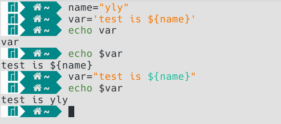

## 1.变量


### 1.注释

```shell
# 注释
:<<EOF
	多行注释
EOF
:<<！
	多行注释
！
```


### 2.变量

 - 创建普通变量
```shell
name="test"  
#等号两边不可有空格
```
 - 创建只可函数体中使用的局部变量
```shell
local name="test"
```
 - 使用变量
```shell
echo ${name}
```
 - 重新赋值
```shell
name="new_test"
```
 - 设置只读
```shell
name="read_only"
readonly name
```
 - 删除变量
```shell
unset name
#unset不能删除只读变量
```


### 3. 字符串变量

1. 单引号

   ```shell
   var='test is ${name}'  
   #单引号里面是什么输出的时候就是什么，不能显示变量值
   #单引号中不能出现单独的单引号，转义字符也不行
   ```

2. 双引号

   ```shell
   var=“test is ${name}”
   #单引号不可以的双引号都可以
   ```

   

3. 拼接字符串

   中间不需要任何类似于+的字符，直接在字符串后面接上要拼接的字符串即可，不过，直接接上是没有空格的

   

4. 获取字符串长度

   ```shell
   #在${}中使用‘#’获取长度
   name="test"
   echo ${#name}
   ```

   

5. 提取字符串

```shell
# 在变量后加入':start:end'
echo ${name:1:2}  #"es"
```


### 4.数组

1. bash只支持一维数组，不支持多维数组

2. 定义数组时小括弧做边界，使用空格分离

   ```shell
   array_name=(li wang xiang zhang)
   ```

3. 单独定义数组元素，定义的数组下标可以不连续

   ```shell
   arraypara[0]="w"
   arraypara[3]="s"
   ```

4. 对某一个数组元素赋值和python一样

   ```shell
   arraypara[3]='t'
   ```

5. 输出数组元素

   ```shell
   echo ${array_name[0]} #li
   echo ${array_name[@]} #输出所有元素
   ```

6. 获取元素个数

   ```shell
   echo ${#array_name[@]}
   ```

7. 获取单个元素的长度

   ```shell
   echo ${#array_name[0]}
   ```

   

### 5. 参数传递


## 2.运算符

### 1. 算数运算

> 默认情况下，Shell 不会直接进行算术运算，而是把`+`两边的数据（数值或者变量）当做字符串，把`+`当做字符串连接符，最终的结果是把两个字符串拼接在一起形成一个新的字符串。
>
> **这是因为，在 Bash Shell 中，如果不特别指明，每一个变量的值都是字符串，无论你给变量赋值时有没有使用引号，值都会以字符串的形式存储。**
>
> 换句话说，Bash shell 在默认情况下不会区分变量类型，即使你将整数和小数赋值给变量，它们也会被视为字符串，这一点和大部分的编程语言不同。


```shell
# var=`echo "option1;option2;...;expression"|bc`
# option一般用于设置精度scale和给变量赋值
area=`echo "scale=2;r=5;3.1414*r*r"|bc`
echo ${area}
# 这个方法受限制较多

# 最常用的是放在脚本中：
value=`bc<<EOF  
scale=3
r=3
3.1415*r*r
EOF`
echo $value
```

### 2. 数字关系运算符

> 关系运算符只支持数字，不支持字符串，除非字符串的值是数字


### 3. 字符串运算符


### 4. 布尔运算符


### 5. 逻辑运算符


### 6. 文件运算符


## 3. 输出

### 1. echo

- 仅用于字符串的输出

### 2. printf

- 不会像echo自动添加换行符，需要手动添加\n

- 无大括号，直接以空格分割

- 格式：

  ```shell
  printf format-string [arguments...]
  # format-string:格式控制字符串
  # arguments:参数列表
  ```

- 案例：

  ```shell
  printf "%-10s %-8s %-4.2f\n" 郭靖 男 66.1234
  
  # %-10s ： 指一个宽度为 10 个字符（-表示左对齐，没有则表示右对齐），任何字符都会被显示在 10 个字符宽的字符内，如果不足则自动以空格填充，超过也会将内容全部显示出来。
  # %-4.2f ：指格式化为小数，宽度为 4 个字符，其中.2指保留 2 位小数。
  ```

  

- 格式替代符：

  > %s %c %d %f 都是格式替代符
  >
  >     * d：Decimal 十进制整数 对应位置参数必须是十进制整数，否则报错!
  >             
  >     * s：String 字符串 对应位置参数必须是字符串或者字符型 否则报错
  >             
  >     * c：Char 字符 对应位置参数必须是字符串或者字符型 否则报错
  >             
  >     * f：Float 浮点 对应位置参数必须是数字型 否则报错

  

- 转义符：

  > ​    \* \a	：警告字符，通常为 ASCII 的 BEL 字符
  >
  > ​    \* \b	：后退
  >
  > ​    \* \c	：抑制（不显示）输出结果中任何结尾的换行字符（只在 %b 格式指示符控制下的参数字符串中有效），而且，任何留在参数里的字符、任何接下来的参数以及任何留在格式字符串中的字符，都被忽略
  >
  > ​    \* \f	：换页（formfeed）
  >
  > ​    \* \n	：换行
  >
  > ​    \* \r	：回车（Carriage return）
  >
  > ​    \* \t	：水平制表符
  >
  > ​    \* \v	：垂直制表符
  >
  > ​    \* \\	：一个字面上的反斜杠字符
  >
  > ​    \* \ddd	：表示 1 到 3 位数八进制值的字符。仅在格式字符串中有效
  >
  > ​    \* \0ddd	：表示 1 到 3 位的八进制值字符

## 4. 流程控制

### 1. if else

- if

```shell
if condition
then
	command1
    command2 
    ...    
    commandN 
fi
```

- if else

```shell
if condition
then
	command1
    command2
    ...    
    commandN
else
	command
fi
```

- if else-if else

```shell
if condition1
then
	command1
elif
	condition2 
then     
	command2
else
	commandN
fi
```

### 2. for

```shell
for var in item1 item2 ... itemN
do
	command1
	command2
	...
	commandN
done
```

### 3. while

- while condition

  ```shell
  while condition
  do
  	command
  done
  ```

- while true

  ```shell
  while :
  do
  	command
  done
  ```

  

### 4. until

- until循环执行一系列命令直到条件为true停止

- until循环与while循环在处理方式上刚好相反

  ```shell
  until condition
  do
  	command
  done
  ```


### 5. case

```shell
case 值 in
  模式1)
    command1
    command2
    ...
    commandN
    ;;
  模式2）
    command1
    command2
    ...
    commandN
    ;;
esac
```


### 6. 跳出循环

- break: 跳出循环
- continue: 结束当前的循环，进入下一个循环


## 4. 定义函数

### 1. 函数定义

```shell
[ function ] funname()
{
	action;
	[return int;]
}
```

### 2. 参数调用

```shell
funname 0 1 2
```

### 3. 返回值

- return可存在也可不存在
- 只能return [0-255] 
- 如果不加 return ， 则默认最后一条语句的执行状态所为函数执行状态的返回值，如果最后一条语句执行成功，则 $?为 0，否则不为 0

### 4. 返回值的使用

- 有return时：等号获得的则是return的结果
- 没有return时：获取的是函数体内所有的 echo、printf 输出<u>组合成的一个字符串</u>

## 5. 外部输入

```shell
read arg
# 将外部输入赋值到arg变量上以供脚本使用
```

 ## 6. 颜色标识

```shell
printf  "\033[32m SUCCESS: yay \033[0m\n";
printf  "\033[33m WARNING: hmm \033[0m\n";
printf  "\033[31m ERROR: fubar \033[0m\n";
```


## 7.长句换行

- 使用\可给过长的语句换行而不改变其句意

  

## 8. 脚本调试

- 检查是否有语法错误-n：
  - bash -n test.sh
- 执行调试脚本-x：
  - bash -x test.sh


